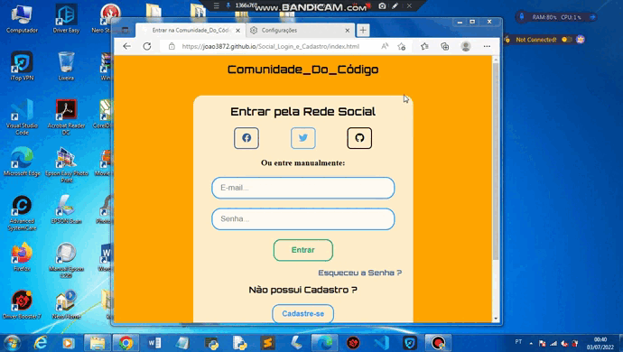

## Página de Social Login e Cadastro

### Observações:

* Este projeto, possui uma página de login e outra de cadastro, para um grupo fictício.

* E as duas páginas, possui o Dark Mode.

### Versão Mobile 📱:

### Tablet :

### Versão Desktop 💻:

### Dark Mode Mobile 🌑:

### Dark Mode Tablet 🌑:

### Dark Mode Desktop 🌑:

### Experimente você mesmo:

* #### <a href="https://joao3872.github.io/Social_Login_e_Cadastro/" target="_blank">Acesse Aqui</a>
